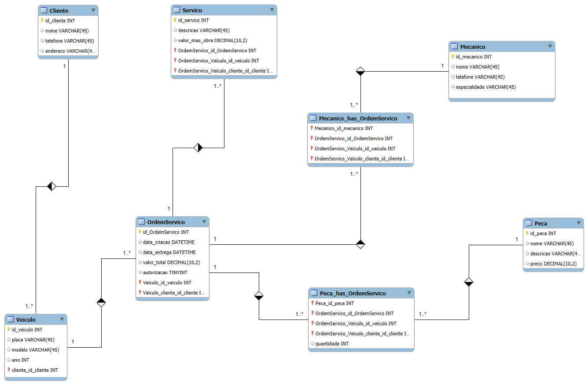

# Construindo um Esquema Conceitual para Banco de Dados

Projeto com o objetivo de criar um esquema conceitual para o contexto de oficina com base na narrativa fornecida.

## Narrativa

- Sistema de controle e gerenciamento de execução de ordens de serviço em uma oficina mecânica;
- Clientes levam veículos à oficina mecânica para serem consertados ou para passarem por revisões periódicas;
- Cada veículo é designadoa uma equipe de mecânicos que identifica os serviços a serem executados e preenche uma OS (Ordem de Serviço) com data de entrega.
- A partir da OS, calcula-se o valor de cada serviço, consultando-se uma tabela de referência de mão-de-obra;
- O valor de cada peça também irá compor a OS;
- O cliente autoriza a execução dos serviços;
- A mesma equipe avalia e executa os serviços;
- Os mecânicos possuem código, nome, endereço e especialidade;
- Cada OS pode ter vários tipos de peças e uma peça pode estar presente em mais de uma OS (relacionamento n para n);

## Entidades Principais

- **Cliente**: Pessoa que leva o veículo para conserto ou revisão.
  - **id_cliente (PK)**
  - nome
  - telefone
  - endereço
- **Veículo**: Veículo trazido pelo cliente;
  - **id_veículo (PK)**
  - placa
  - modelo
  - ano
  - **id_cliente (FK)**
- **Ordem de Serviço (OS)**: Registro de uma solicitação de serviço para um veículo.
  - **id_os (PK)**
  - data_criacao
  - data_entrega
  - **id_veiculo**
  - **id_cliente**
  - valor_total
  - autorizacao_cliente
- **Mecânico**: Profissional que avalia e executa os serviços.
  - **id_mecanico (PK)**
  - nome
  - telefone
  - especialidade
- **Serviço**: Serviço a ser realizado no veículo.
  - **id_servico (PK)**
  - descricao
  - valor_mao_de_obra
  - **id_os (FK)**
- **Peça**: Peça utilizada.
  - **id_peca (PK)**
  - nome
  - descricao
  - preco_unitario

## Relacionamentos

- **Cliente - Veículo**: 1 para n.
- **Veículo - OS**: 1 para n.
- **OS - Serviço**: 1 para n.
- **OS - Peça**: n para n.
- **Mecânico - OS**:  n para n.

## Tabelas Associativas

- **OS_Peca**
  - id_os
  - id_peca
  - quantidade
- **Mecanico_OS**
  - id_mecanico
  - id_os

## Resultado MySQL

